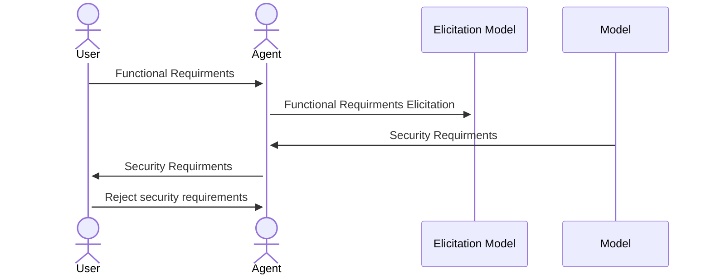

# Intelligent Virtual Agent for Security Requirements Elicitation

This repository contains the source code of the intelligent virtual agent proposed in the paper:

**“An Intelligent Agent with a Human-in-the-Loop Approach to Support the Specification of Software Safety Requirements: A Pilot Study”**

The project explores the use of an embodied virtual agent to support the elicitation and specification of software security requirements derived from functional requirements.

The agent combines Large Language Models (LLMs), Speech-to-Text (STT), Text-to-Speech (TTS), and a Human-in-the-Loop (HITL) interaction process to improve the relevance and usability of generated security requirements.

---

## Objective

The main objective of this project is to assist business users and technical professionals with limited security expertise in identifying and refining software security requirements.

Instead of relying on a fully automated LLM process, the system introduces a virtual embodied agent that allows users to:

* submit functional requirements
* receive automatically generated security requirements
* review generated requirements
* reject irrelevant requirements
* refine and validate results
* improve final requirement quality through human supervision

This hybrid approach seeks to improve requirement relevance while maintaining strong coverage.

---

## System Architecture

The solution was developed using **Unity 2D** and deployed as a browser-based application to maximize accessibility.

### Main Components

### 1. Virtual Agent (Unity)

The embodied avatar provides the user interface and conversational interaction.

Responsibilities:

* visual interaction with the user
* voice-based communication
* presentation of generated requirements
* support during requirement refinement

---

### 2. Speech-to-Text (STT)

Used to convert user speech into text for real-time interaction.

Implementation used:

* OpenAI Whisper API

Why:

* high transcription accuracy
* low latency
* strong multilingual support
* robust performance in real-world conditions

---

### 3. Text-to-Speech (TTS)

Used to generate natural voice responses from the virtual agent.

Implementation used:

* ElevenLabs API

Why:

* high-quality natural voices
* customizable voice generation
* fast response time
* improved conversational realism

---

### 4. Security Requirements Elicitation Model

This module receives functional requirements and generates corresponding security requirements based on:

* security objectives
* security templates
* security patterns
* previous studies by Riaz et al.
* replication studies using LLMs

Security objectives considered:

* Confidentiality (C)
* Integrity (I)
* Availability (A)
* Identification & Authentication (ID)
* Accountability (AY)
* Privacy (PR)

---

## Interaction Flow



---

## Experimental Context

This system was evaluated in a pilot study with 20 graduate students from the University of Costa Rica.

Two conditions were compared:

### Control Group

Security requirements generated by the LLM without human intervention.

### Experimental Group

Security requirements generated with user interaction through the intelligent virtual agent.

Evaluation metrics:

* Coverage → Recall
* Relevance → Precision
* Satisfaction → System Usability Scale (SUS)

---

## Technologies

Technology stack used:

* Unity 2D
* C#
* OpenAI Whisper API
* ElevenLabs API
* LLM backend for requirement generation
* Web deployment (WebGL)
* REST API integration

---

## Repository Structure

```text
docs/
frontend/
backend/
```

---

## Citation

If you use this repository for academic purposes, please cite the corresponding paper.

```bibtex
@inproceedings{PerezMorera2026,
  title={An Intelligent Agent with a Human-in-the-Loop Approach to Support the Specification of Software Safety Requirements: A Pilot Study},
  author={Pérez-Morera, Daniel},
  year={2026}
}
```

---

## Author

Daniel Pérez-Morera
University of Costa Rica
CITIC, PCI
