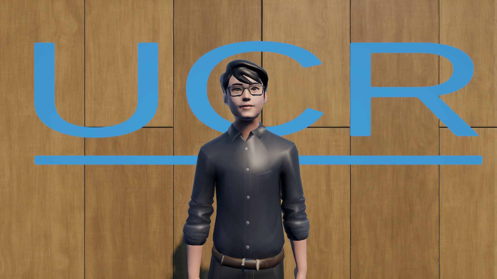
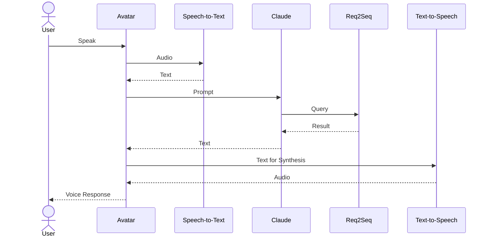

# Intelligent Virtual Agent for Security Requirements Elicitation



This repository contains the source code of an intelligent virtual agent designed to support the elicitation and specification of software security requirements from functional requirements.

The project combines Large Language Models (LLMs), speech technologies, and an embodied conversational agent to assist users in applying the security requirements derivation strategy proposed by Riaz et al. (2014).

The system was developed as part of a pilot study evaluating the feasibility of using virtual agents to support software security requirements engineering tasks.

---

## Setup

To configure and run the project for the first time, follow the detailed setup guide in [Setup.md](Setup.md).

---

## Objective

The primary objective of this project is to assist software engineers, analysts, students, and business stakeholders in deriving security requirements from functional requirements.

Unlike fully automated approaches, the proposed solution introduces an embodied virtual agent capable of interacting with users through voice conversations. The agent guides users during the identification of security objectives, security patterns, and security requirements while maintaining human participation throughout the process.

The system aims to:

* Support the identification of software security requirements.
* Reduce the effort required to apply security requirement derivation techniques.
* Improve the accessibility of security engineering practices for non-experts.
* Provide a natural and engaging interaction through an embodied virtual agent.

---

## System Architecture

The system was developed using Unity and integrates speech technologies, large language models, and a Model Context Protocol (MCP) server specialized in security requirements engineering.

### Main Components

### 1. Virtual Agent (Unity)

The virtual agent provides a 3D embodied interface through which users interact with the system.

Responsibilities:

* Conversational interaction with users.
* Audio playback and avatar animation.
* User input management.
* Lip synchronization during speech generation.
* Integration with AI services.

---

### 2. Speech-to-Text (STT)

The system uses OpenAI's speech recognition services to convert user speech into text.

Implementation:

* gpt-4o-mini-transcribe

Features:

* Real-time speech transcription.
* Multilingual support.
* High transcription accuracy.

---

### 3. Text-to-Speech (TTS)

The virtual agent generates spoken responses using OpenAI's text-to-speech service.

Implementation:

* gpt-4o-mini-tts
* Voice: Alloy

Features:

* Natural voice generation.
* Low latency responses.
* Seamless integration with avatar lip synchronization.

---

### 4. LLM Orchestrator

The conversational intelligence of the agent is managed by Claude Haiku 4.5.

Implementation:

* ClaudeHaiku4_5_20251001

Responsibilities:

* Understanding user requests.
* Managing conversations.
* Deciding when to invoke external tools.
* Generating explanations and recommendations.

---

### 5. Req2Seq MCP Server

The system incorporates a specialized MCP server called Req2Seq.

Req2Seq provides domain-specific knowledge for security requirements engineering and assists the LLM in applying the methodology proposed by Riaz et al. (2014).

Capabilities:

* Identification of security objectives.
* Selection of security patterns.
* Generation of security requirements.
* Traceability between functional and security requirements.

Security objectives supported include:

* Confidentiality
* Integrity
* Availability
* Identification and Authentication
* Accountability
* Privacy

---

## Interaction Flow


```mermaid
sequenceDiagram
    actor U as User
    participant Avatar
    participant STT as Speech-to-Text
    participant Claude
    participant MCP as Req2Seq
    participant TTS as Text-to-Speech

    U->>Avatar: Speak
    Avatar->>STT: Audio
    STT-->>Avatar: Text

    Avatar->>Claude: Prompt
    Claude->>MCP: Query
    MCP-->>Claude: Result

    Claude-->>Avatar: Text

    Avatar->>TTS: Text for Synthesis
    TTS-->>Avatar: Audio

    Avatar-->>U: Voice Response
```

---

## Experimental Context

The system is being evaluated through a pilot study involving graduate students from the University of Costa Rica.

Participants interact with the virtual agent to derive security requirements from functional requirements while applying the strategy proposed by Riaz et al. (2014).

The study evaluates four main metrics:

* Coverage (Recall)
* Relevance (Precision)
* Efficiency (True Positives per Minute)
* User Satisfaction (System Usability Scale - SUS)

The results obtained with the virtual agent are compared against previously reported results from automated LLM-based security requirements generation approaches.

---

## Technology Stack

* Unity 3D
* C#
* OpenAI API

  * gpt-4o-mini-transcribe
  * gpt-4o-mini-tts
* Anthropic Claude Haiku 4.5
* Model Context Protocol (MCP)
* Req2Seq MCP Server
* WebGL Deployment
* REST APIs

---

## Repository Structure

```text
backend/
docs/
frontend/
imgs/
```

---

## Demo

Watch a demonstration of the intelligent virtual agent in action:

[Demo on YouTube](https://youtu.be/oQdS7Oj8X_w)

---

Sí, puedes agregarlo como referencia directa al documento dentro del repositorio. Te dejo una forma limpia de incluirlo en la sección **Citation** (sin usar links markdown):

Puedes añadir esto justo antes o después del BibTeX:

---

## Paper

The full paper associated with this project is available [here](docs/An_intelligent_agent_with_a_human_in_the_loop_approach_to_support_the_specification_of_software_safety_requirements.pdf).

---

## Citation

If you use this repository for academic purposes, please cite the corresponding paper.

```bibtex
@inproceedings{PerezMorera2026,
  title={An intelligent agent with a human-in-the-loop approach to support the specification of software safety requirements: A work in progress},
  author={Pérez-Morera, Daniel},
  year={2026}
}
```

---

## Author

Daniel Pérez-Morera  
University of Costa Rica  
CITIC, PCI
