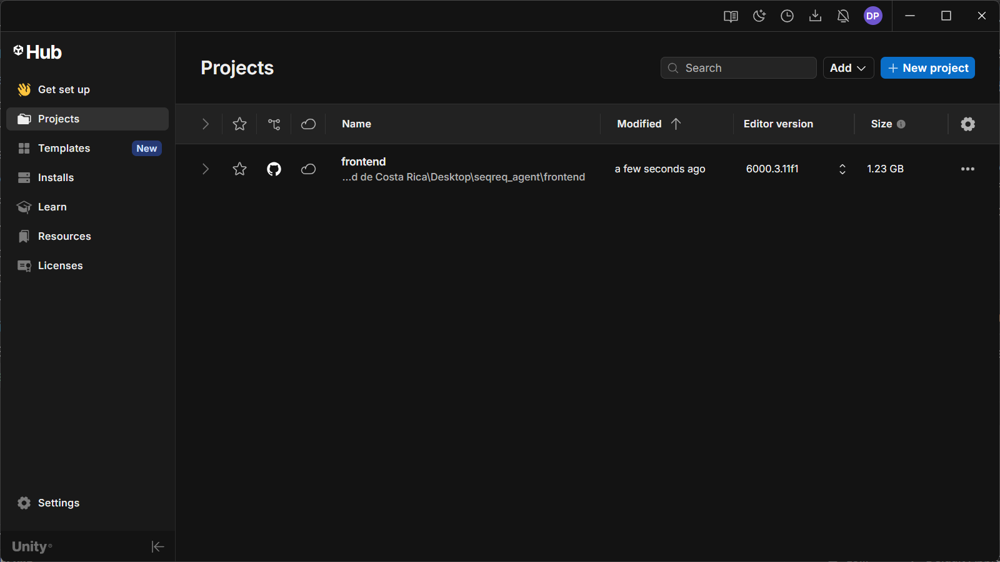
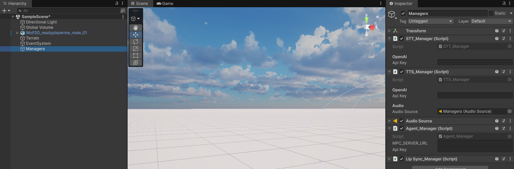
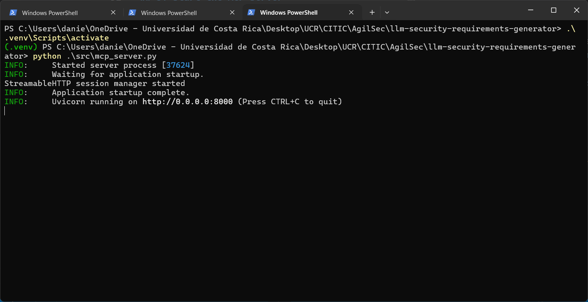
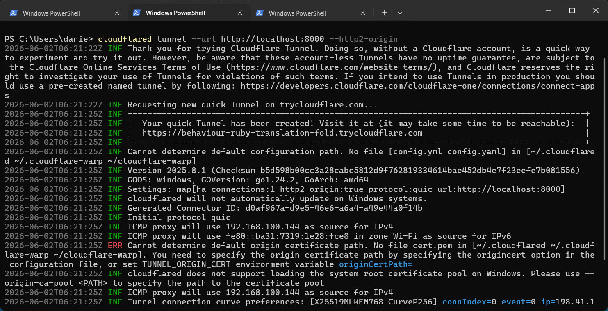

# Project Setup Guide

This guide explains how to prepare and run the Unity project for the first time.

## Requirements

- Unity Hub installed.
- Unity Editor version `6000.3.11f1` installed through Unity Hub.
- OpenAI API key.
- Anthropic API key.
- Access to the MCP server URL that will be used by the Unity project.

## 1. Open the Project in Unity Hub

1. Open Unity Hub.
2. Click **Add**.
3. Select the current project folder and add it to Unity Hub.
4. Open the project using Unity Editor version `6000.3.11f1`.



## 2. Configure the Scene Managers

1. Once the project opens in the Unity Editor, load the main scene.
2. Locate the **Managers** GameObject in the scene hierarchy.
3. Select the component that contains the agent configuration.
4. Fill in the API key fields for OpenAI and Anthropic in the Inspector.
5. Set the MCP server URL that the agent will use.



## 3. Start the MCP Server

The Unity project expects a working MCP server endpoint before the agent can respond.

If you need to run the server locally, follow the backend instructions in [backend/Readme.md](backend/Readme.md).

Typical local backend setup:

```bash
cd backend
python -m venv .venv
.venv\Scripts\Activate
pip install -r requirements.txt
python .\src\mcp_server.py
```

If you need public access to the server, you can expose it with Cloudflare Tunnel as described in the backend README, then use the generated `/mcp` URL in Unity.





## 4. Run the Project

1. Return to Unity and make sure the scene is ready.
2. Press **Play** to run the project.
3. When you want to talk to the agent, press **Space** so the agent can listen.
4. Speak your request after pressing Space.
5. Wait for the agent response.


## Notes

- If the agent does not respond, verify the API keys and the MCP server URL first.
- If you are using a remote MCP server, confirm that the endpoint is reachable before pressing Play.
